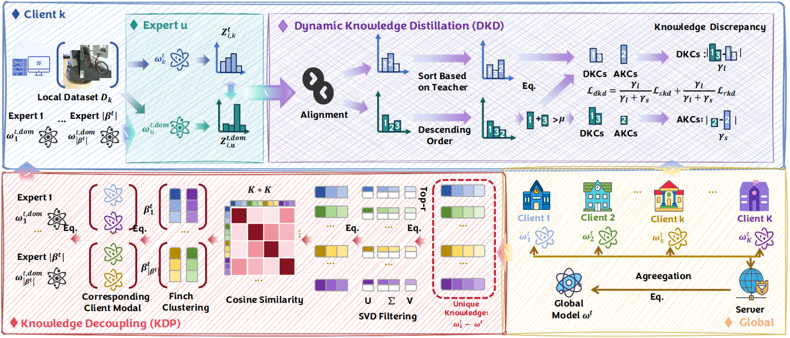

<h1 align="center">DKDR </h1>

<em>DKDR: Dynamic Knowledge Distillation for Reliability in Federated Learning [Link](https://openreview.net/pdf?id=To2fQWv0zP) </strong>
 

<h2> Abstract </h2>
Federated Learning (FL) has demonstrated a promising future in privacy-friendly collaboration but it faces the data heterogeneity problem. Knowledge Distillation (KD) can serve as an effective method to address this issue. However, challenges arise from the unreliability of existing distillation methods in multi-domain scenarios.
Prevalent distillation solutions primarily aim to fit the distributions of the global model directly by minimizing forward Kullback-Leibler divergence (KLD). This results in significant bias when the outputs of the global model are multi-peaked, which indicates the unreliability of distillation pathway. Meanwhile, cross-domain update conflicts can notably reduce the accuracy of the global model (teacher model) in certain domains, reflecting the unreliability of the teacher model in these domains.
In this work, we propose DKDR (Dynamic Knowledge Distillation for Reliability in Federated Learning), which dynamically assigns weights to forward and reverse KLD based on knowledge discrepancies. This enables clients to fit the outputs from the teacher precisely. Moreover, we use knowledge decoupling to identify domain experts, thus clients can acquire reliable domain knowledge from experts. Empirical results from single-domain and multi-domain image classification tasks demonstrate the effectiveness of the proposed method and the efficiency of its key modules.

